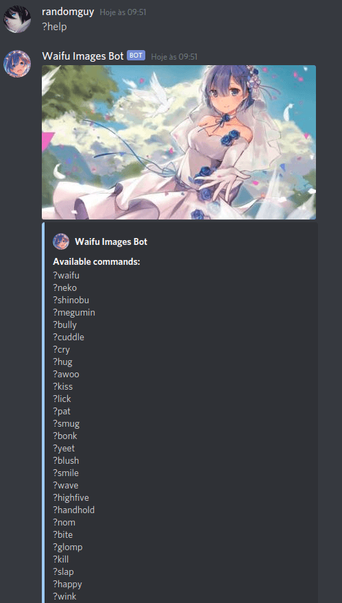
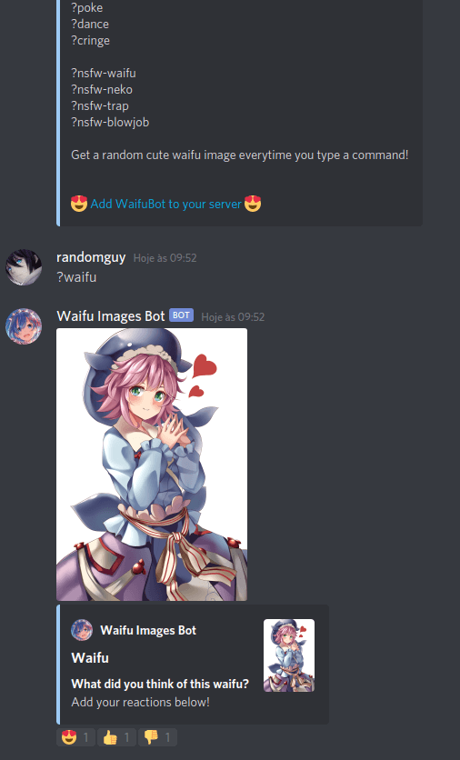

<div align="center">
  
  <h1>Waifu Images Bot</h1>
  <br />
  <p>
    <a href="https://top.gg/bot/794404553088827443">
      
    </a>
    <a href="https://github.com/guastallaigor/waifu-images-bot/blob/main/package.json"></a>
    <a href="https://github.com/guastallaigor/waifu-images-bot/blob/main/LICENSE"></a>    
  </p>  
</div>

Discord Bot\
Get a random waifu image everytime you type any command!\
This bot uses the <a href="https://github.com/Waifu-pics/api" target="_blank">Waifu Pics API</a>\
Type ?help to get a list of all available commands

> Notes: Some of the commands may be unavailable due to lack of images from the API. Also sometimes you may get an image that's larger than 8MB, which is going to be blocked by Discord.

## Usage

**This bot has reached the maximum limit of servers he can be in , since it is not verified. I've already submitted for Discord's verification process, but I don't know if or when Discord is going to approve it.**

Add to your server https://discord.com/oauth2/authorize?client_id=794404553088827443&scope=bot&permissions=44096

## Demo

<div align="center">
  
  
</div>

## Development

[](https://github.com/guastallaigor/waifu-images-bot/issues)

> **Note**: Contributions are very welcomed, however is very important to open a new issue using the issue template **before** you start working on anything, so we can discuss it before hand

Fork the project and enter this commands in your terminal

```sh
$ git clone https://github.com/YOUR_GITHUB_USERNAME/waifu-images-bot.git
$ cd waifu-images-bot
$ yarn
$ yarn dev
```

You need to create a `.env` file with this configuration:

```sh
DISCORD_TOKEN=
DISCORD_PREFIX=
DISCORD_LINK=
```

[](https://ko-fi.com/C1C63QCB8)

## License

[MIT © guastallaigor](https://github.com/guastallaigor/waifu-images-bot/blob/master/LICENSE)
